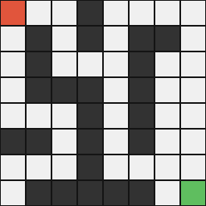

# RL Algorithm Zoo

An original Game AI course project that compares four reinforcement learning algorithms on a custom 8x8 maze environment with compact vector observations. The project includes tabular, policy-gradient, and Stable-Baselines3 baselines, plus saved comparison outputs and short policy demos.

## Setup

```bash
python3 -m venv .venv
source .venv/bin/activate
pip install -r requirements.txt
```

## Run

```bash
python3 main.py --mode train-q
python3 main.py --mode train-reinforce
python3 main.py --mode train-a2c
python3 main.py --mode train-ppo
python3 main.py --mode compare-results
python3 main.py --mode record-demos
```

## Algorithms

- Q-Learning
- REINFORCE
- A2C
- PPO

## Results

Saved summaries, plots, and comparison files are written under `results/`. The comparison step creates a final table, report, and presentation-friendly plots in `results/comparison/`.

## Q-Learning



## REINFORCE


## A2C


## PPO


